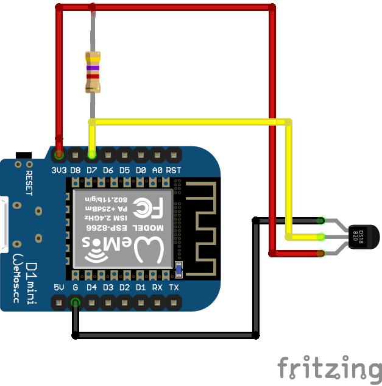
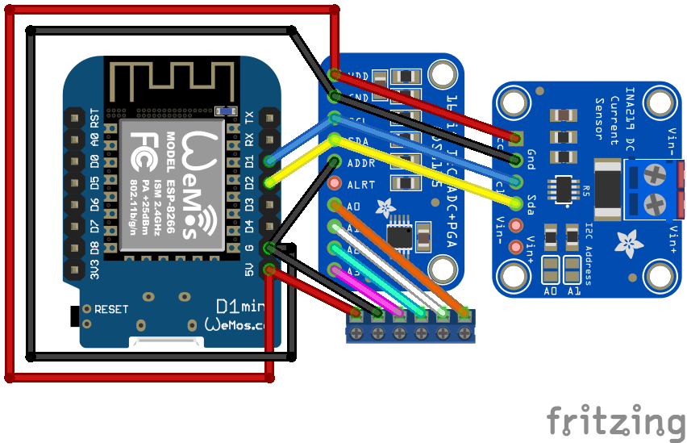
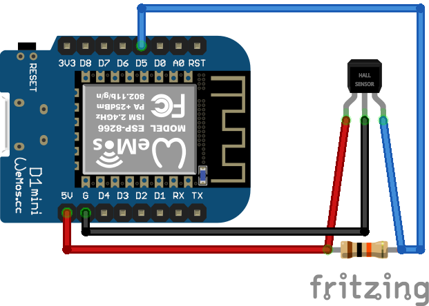

# Haddock-specific Notes

## Sensors

### `salon_environment`

Equipment

 * Wemos D1 ESP8266
 * BMP280 temperature and atm pressure sensor
 * Using `ESP.deepSleep()` (c.f. `sensors/deepsleeptimer`) as temperature tends to travel upwards while the device is continuously on

Wiring

```
Wemos D1  BMP240
     3v3  VCC
     3v3  CSB
       G  GND
       G  SDO
      D1  SCL
      D2  SDA
  D0-RST  (jumper for ESP8266 deep sleep)
```

Compilation

 * `make upload_salon_environment`

Configuration

 * Both temperature and pressure sensor have a linear transform which can be configured from the sensor UI (`PressureTransform` and `TemperatureTransform`)
 * To avoid the warming device affecting the temperature measurement the deep sleep feature can be configured at the UI (`DeepSleepTimer`)
  * A closed connection between `D0` and `RST` is required for deep sleep
  * If you need the device to stay on open the connection - N.B.! The device still reboots when `ESP.deepSleep()` is called
  * Setting `Time before sleep` to `0` disables deep sleep (this is the default)

References

 * https://www.instructables.com/Library-for-BMP280/

### `temp_outdoor`, `temp_engineroom`, `temp_batt1`, `temp_batt2`, `temp_batt3`

The first attempt to measure machine room temperatures was done using MAX31855 and
thermocouple sensors. However, the sensors got a lot of noise from the machine room
lightning and had to be abandoned.

Equipment
 * Wemos D1 ESP8266
 * DS18B20
 * resistor 4,7k

Wiring



Compilation

 * `make upload_temp_engineroom`
 * `make upload_temp_batt1` ... `3`

Configuration

 * Adjust temperature value at `Temp/LinearTransform`

### `current_consumption`

Equipment

 * Wemos D1 ESP8266
 * ADS1115 AD converter
 * Shunt 40A 75mV

Wiring

```
Wemos D1  ADS1115
--------  -------
     5v  VCC
      G  GND
      G  ADDR
     D1  SCL
     D2  SDA
     A0  shunt
     A1  shunt
```

Compilation

 * `make upload_current_consumption`

Configuration

 * Adjust current transform line parameters at `Current/LinearTransform`
 * The theoretical multipliers are:
  * 1.0 for 100mV shunt
  * 0,57 for 75mV shunt (default)
  * 2.0 for 50mV shunt

### `electricity_consumption`, `electricity_batt1`, `electricity_batt2`, `electricity_batt3`

Electricity sensor measures voltage and using INA226 (0-32V). [A special version of
INA226](https://www.aliexpress.com/item/1005002877920242.html) with internal shunt capable of 20A current was used to avoid external shunt.

Equipment

 * Wemos D1 ESP8266
 * INA226

Wiring

```
Wemos D1  INA226
--------  ------
      5v  VCC
       G  GND
      D1  SCL
      D2  SDA
```



N.B.! The ADS1115 was not used.

Compilation

 * `make upload_electricity_consumption`
 * `make upload_electricity_batt1`
 * `make upload_electricity_batt2`
 * `make upload_electricity_batt3`

Configuration

 * Both voltage and current measurement has a linear transform

### `tank_fuel`, `tank_fresh` and `tank_black`

Equipment

  * Wemos D1 ESP8266
  * Fuel and fresh tank gauge: Standard 0-180 ohm tank level sensor (ECMS, Wema)
    * 0 ohms = empty
    * 180 ohms = full
  * Black water gauge: Wema 240-30 ohm tank level sensor
    * 240 ohm = empty
    * 30 ohms = full

Wiring


Compilation

  * `make upload_tank_fuel`
  * `make upload_tank_fresh`
  * `make upload_tank_black`

Configuration

  * The raw values can be read from `/Tank/LinearTransformBeforeCurve`
  * The mapping from raw min-max range can be configured at `/Tank/CurveInterpolator`
  * By default, the curve interpolator model has values for 0, 25, 50 75 and 100%

### `revs_prop_stb`, `revs_prop_port`

Measures propulsion (propellor axel) revolutions. The unit is RPMs instead of standard SI unit Hz since
SignalK server Instrument panel did not offer a dedicated Hz-to-RPM gauge.

Equipment

  * Wemos D1 ESP8266
  * Hall Sensor A3144
  * Resistor 10 kOhm

Wiring



Compilation

 * `make upload_revs_prop_stb`
 * `make upload_revs_prop_port`

Configuration

 * `/Freq/Frequency` has default value of 60 as the sensor reports RPMs and hot Hz

### `level_bilge`

Measures bilge level using IR distance sensor. The DYP-A02YY sensor gives distance
as PWM output.

Equipment

  * Wemos D1 ESP8266
  * IR distance sensor DYP-A02YY

Wiring

```
Wemos D1  DYP-A02YY
--------  ---------
 5V        red
 G         black
 A0        yellow
```

Compilation

 * `make upload_level_bilge`

Configuration

 * `/Bilge/Measurement` and `/Bilge/LinearTransform`
