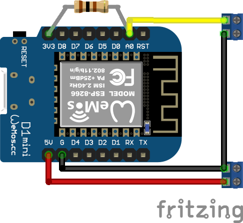

# Haddock-specific Notes

## Sensors

### `salon_environment`

Equipment

 * Wemos D1 ESP8266
 * BMP280 temperature and atm pressure sensor
 * Using `ESP.deepSleep()` (c.f. `sensors/deepsleeptimer`) as temperature tends to travel upwards while the device is continuously on

Wiring

```
Wemos D1  BMP240
     3v3  VCC
     3v3  CSB
       G  GND
       G  SDO
      D1  SCL
      D2  SDA
  D0-RST  (jumper for ESP8266 deep sleep)
```

Compilation

 * `make upload_salon_environment`

Configuration

 * Both temperature and pressure sensor have a linear transform which can be configured from the sensor UI (`PressureTransform` and `TemperatureTransform`)
 * To avoid the warming device affecting the temperature measurement the deep sleep feature can be configured at the UI (`DeepSleepTimer`)
  * A closed connection between `D0` and `RST` is required for deep sleep
  * If you need the device to stay on open the connection - N.B.! The device still reboots when `ESP.deepSleep()` is called
  * Setting `Time before sleep` to `0` disables deep sleep (this is the default)

References

 * https://www.instructables.com/Library-for-BMP280/

### `current_solar`

Equipment

 * Wemos D1 ESP8266
 * ADS1115 AD converter
 * Shunt 40A 75mV

Wiring

```
Wemos D1  ADS1115
--------  -------
      5v  VCC
       G  GND
       G  ADDR
      D1  SCL
      D2  SDA
      A0  shunt
      A1  shunt
```

Compilation

 * `make upload_current_solar`

Configuration

 * Adjust current transform line parameters at `Current/LinearTransform`
 * The theoretical multipliers are:
   * 1.0 for 100mV shunt
   * 0,57 for 75mV shunt (default)
   * 2.0 for 50mV shunt

References

 * Converting raw measurements to volts: https://forums.adafruit.com/viewtopic.php?t=73330
   ```
                                                    ADS1015  ADS1115
                                                    -------  -------
   GAIN_TWOTHIRDS  // 2/3x gain +/- 6.144V  1 bit = 3mV      0.1875mV
   GAIN_ONE        // 1x gain   +/- 4.096V  1 bit = 2mV      0.125mV
   GAIN_TWO        // 2x gain   +/- 2.048V  1 bit = 1mV      0.0625mV
   GAIN_FOUR       // 4x gain   +/- 1.024V  1 bit = 0.5mV    0.03125mV
   GAIN_EIGHT      // 8x gain   +/- 0.512V  1 bit = 0.25mV   0.015625mV
   GAIN_SIXTEEN    // 16x gain  +/- 0.256V  1 bit = 0.125mV  0.0078125mV
   ```

### `voltage_charge`

This sensor reads voltages from each ADS1115 inputs. Taking care of four individual
sensor wirings appears to be too much for ESP8266 as opening the configuration URL
resulted timeouts.

To tackle this issue a new sensor `sensors/ads1115` was written. It combines
communication to ADS1115 and scaling the raw reading thus requiring less
RAM from the MCU.

Equipment

 * Wemos D1 ESP8266
 * ADS1115 AD converter

Wiring

 * Each ADS1115 input is connected to voltage divider, where
   * R1 = 82 kOhm
   * R2 = 15 kOhm
 * The voltage divider scales input range 0-30V to 0-4.6V

Compilation

 * `make upload_voltage_charge`

Configuration

 * Each input has its `/[inputname]/LinearTransform` to adjust scaled voltage reading

### `tank_fuel`, `tank_fresh` and `tank_black`

Equipment

  * Wemos D1 ESP8266
  * Fuel and fresh tank gauge: Standard 0-180 ohm tank level sensor (ECMS, Wema)
    * 0 ohms = empty
    * 180 ohms = full
  * Black water gauge: Wema 240-30 ohm tank level sensor
    * 240 ohm = empty
    * 30 ohms = full

Wiring



Compilation

  * `make upload_tank_fuel`
  * `make upload_tank_fresh`
  * `make upload_tank_black`

Configuration

  * The raw values can be read from `/Tank/LinearTransformBeforeCurve`
  * The mapping from raw min-max range can be configured at `/Tank/CurveInterpolator`
  * By default, the curve interpolator model has values for 0, 25, 50 75 and 100%
